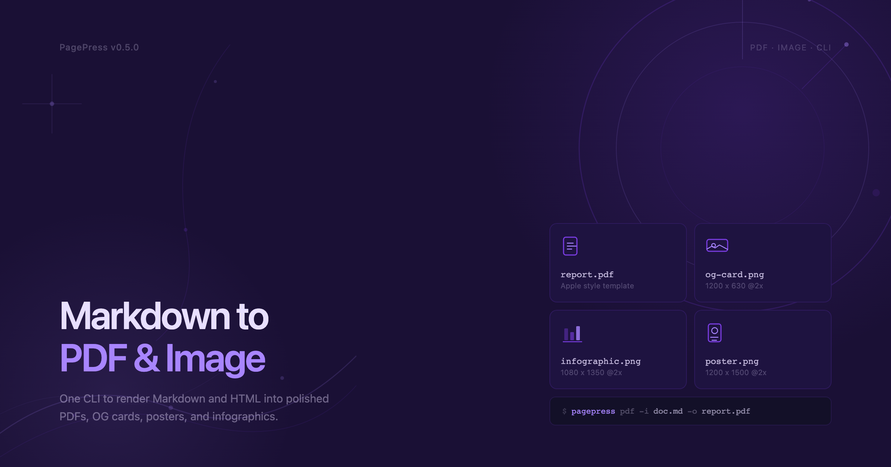
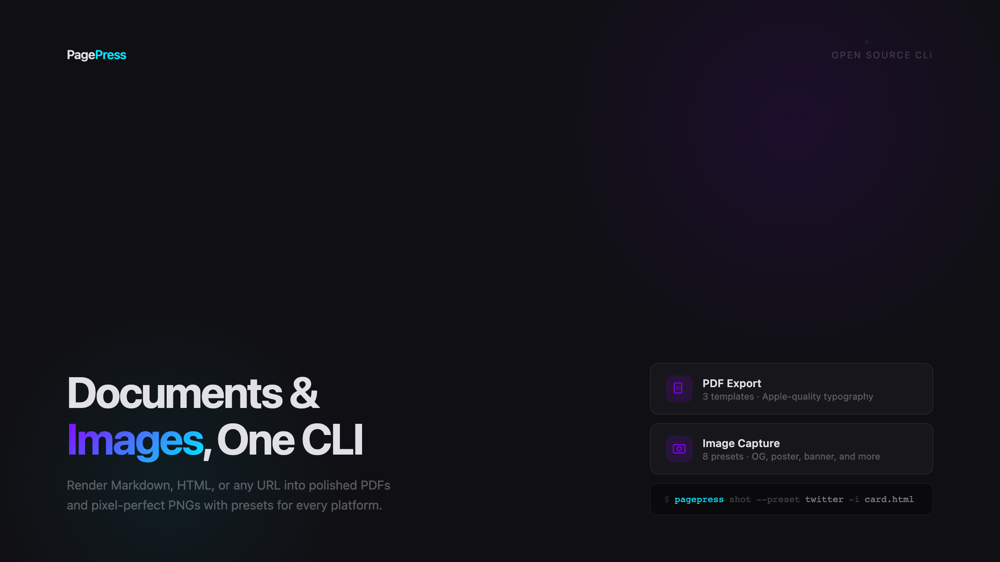
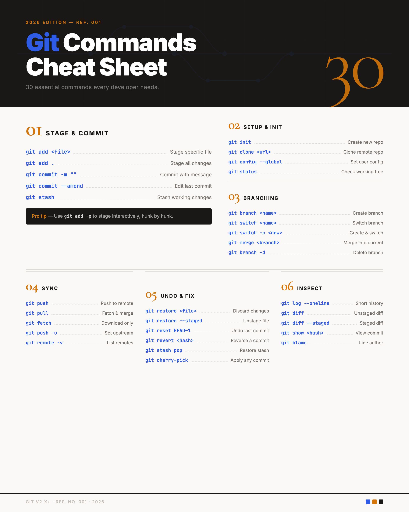

# WebPress

面向 AI Agent 的 HTML 渲染 CLI，可将本地 HTML 文件输出为高质量 PNG 图片。

## 特性

- 专注 PNG 输出（仅 `webpress`）
- 仅支持本地 HTML（不支持远程 URL）
- 内置 8 种图片预设
- 基于 Playwright + Chromium 的稳定渲染
- 使用 `#container` 作为截图区域，输出更可控

## 安装

```bash
npm install -g @liustack/webpress
npx playwright install chromium
```

或使用 `npx`：

```bash
npx @liustack/webpress [options]
```

## 用法

```bash
# 生成 OG 卡片
webpress -i card.html -o og.png --preset og

# 生成信息图
webpress -i stats.html -o infographic.png --preset infographic
```

## 预设尺寸

| 预设 | 尺寸 | 示例 |
|------|------|------|
| `og` | 1200x630 |  |
| `twitter` | 1200x675 |  |
| `banner` | 1600x900 |  |
| `youtube` | 1280x720 |  |
| `wechat` | 900x383 |  |
| `infographic` | 1080x1350 |  |
| `poster` | 1200x1500 |  |
| `xiaohongshu` | 1080x1440 |  |

## 参数

- `-i, --input <path>` 输入 HTML 路径
- `-o, --output <path>` 输出 PNG 路径
- `-p, --preset <name>` 预设名称（默认 `og`）
- `--width <number>` 自定义宽度
- `--height <number>` 自定义高度
- `--scale <number>` 设备缩放（默认 `2`）
- `--wait-until <state>` `load | domcontentloaded | networkidle`
- `--timeout <ms>` 超时时间（毫秒）
- `--safe` 禁用外部网络请求和 JavaScript 执行

> PNG 渲染要求 HTML 中存在 `#container` 元素，否则会失败。

## AI Agent Skill

- [webpress/SKILL.md](skills/webpress/SKILL.md)

## License

MIT
